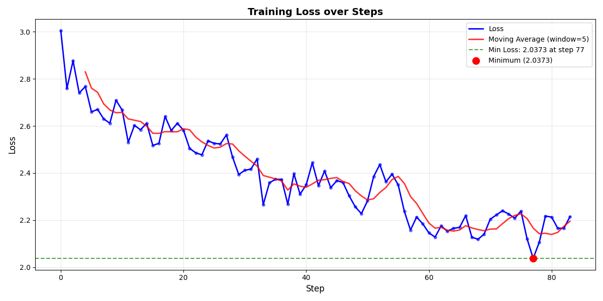

# LLM_LoRa_training

## Цель - дообучение LLM Qwen2.5/0.5B на датасете с медицинской информацией

### Проект состоит из следующих файлов:
- train.py - обучение модели
- chat.py - общение с моделью

### Запуск обучения
``` python
python train_model.py \
  --model_name Qwen/Qwen2.5-0.5B \
  --dataset_name lavita/ChatDoctor-HealthCareMagic-100k \
  --max_samples 5000 \
  --output_dir ./my-lora-model \
  --use_lora
```

### Запуск общения
``` python
python chat.py
```

## 1. Используемая модель и параметры

### Базовая модель
- **Название**: `Qwen/Qwen2.5-0.5B`
- **Размер**: 0.5 млрд параметров
- **Источник**: HuggingFace Transformers

---

## 2. Параметры обучения
Из файла `train.py`
### Конфигурация LoRA
```python
lora_config = LoraConfig(
            task_type=TaskType.CAUSAL_LM,
            inference_mode=False,
            r=args.lora_r,
            lora_alpha=args.lora_alpha,
            lora_dropout=args.lora_dropout,
            target_modules=target_modules,
            bias="none",
        )
```
### Параметры обучения
```python
training_args = TrainingArguments(
        output_dir=args.output_dir,
        overwrite_output_dir=True,
        
        # Параметры батча
        per_device_train_batch_size=args.per_device_train_batch_size,
        per_device_eval_batch_size=args.per_device_train_batch_size,
        gradient_accumulation_steps=args.gradient_accumulation_steps,
        
        # Параметры оптимизации
        num_train_epochs=args.num_train_epochs,
        learning_rate=args.learning_rate,
        weight_decay=args.weight_decay,
        max_grad_norm=args.max_grad_norm,
        
        # Scheduler
        lr_scheduler_type=args.lr_scheduler_type,
        warmup_steps=args.warmup_steps,
        
        # Сохранение и логирование
        logging_strategy="steps",
        logging_steps=10,
        save_strategy="epoch" if not args.early_stopping else "steps",
        save_steps=100 if args.early_stopping else None,
        save_total_limit=3,
        evaluation_strategy="epoch" if eval_dataset else "no",
        eval_steps=50 if eval_dataset and args.early_stopping else None,
        
        # Mixed precision
        fp16=torch.cuda.is_available() and not (args.use_4bit or args.use_8bit),
        bf16=False,
        
        # Оптимизатор
        optim="adamw_torch",
        
        # Отчетность
        report_to=["tensorboard"] if not (args.use_4bit or args.use_8bit) else [],
        logging_dir=os.path.join(args.output_dir, "logs"),
        
        # Другие параметры
        remove_unused_columns=False,
        label_names=["labels"],
        load_best_model_at_end=bool(eval_dataset),
        metric_for_best_model="eval_loss" if eval_dataset else None,
        greater_is_better=False if eval_dataset else None,
        dataloader_num_workers=min(4, os.cpu_count() or 1) if not (args.use_4bit or args.use_8bit) else 0,
        dataloader_pin_memory=True,
        gradient_checkpointing=args.gradient_checkpointing,

    )
```

### Обучение модели
```python
trainer = Trainer(
        model=model,
        args=training_args,
        train_dataset=train_dataset,
        eval_dataset=eval_dataset,
        data_collator=data_collator,
        tokenizer=tokenizer,
        callbacks=callbacks,
    )

trainer.train()
```
### График обучения

---

## 3. Данные обучения
**Источник данных**
- **Датасет:** lavita/ChatDoctor-HealthCareMagic-100k
- **Формат:**
  - QA (question-answer)
 
### Пример строки из датасета
Что такое резистор?,"Резистор — это пассивный компонент, ограничивающий ток в электрической цепи. Его сопротивление измеряется в омах по закону Ома: U = I × R. Используется для задания рабочих режимов, делителей напряжения, ограничения тока."
    
Чат-промпт:
```
<|instruction|>
Инструкция</s>
<|input|>
Запрос</s>
<|output|>
Ответ</s>
```
Размер датасета 5000 строк
- Разделение:
  - 90% для обучения
  - 10% для валидации

## **Примеры запросов и ответов (тема: Медицина)**
### Без использования LoRA
```
======================================== Базовая модель ========================================
system
You are a helpful assistant.
user
What are the main differences between Crohn's disease and ulcerative colitis in terms of symptoms, treatment, and lifestyle impact?
assistant
Crohn's Disease and Ulcerative Colitis are both inflammatory bowel diseases that can cause abdominal pain, diarrhea, weight loss, and fatigue. However, there are some key differences between the two conditions that may affect their treatment and lifestyle impacts.
One difference is the severity of symptoms for each condition. Crohn's disease often causes more severe symptoms than ulcerative colitis, as it involves the entire digestive system. Ulcerative colitis, on the other hand, tends to cause less severe symptoms

```

```  
======================================== Базовая модель ========================================
system
You are a helpful assistant.
user
I have running nose and sore throat, what can it be?
assistant
Hello! Thank you for asking us to help you with your health concerns. I understand that you're experiencing symptoms of the common cold or flu. The most likely cause is a viral infection. Viral infections usually last about 10 days and don't require any specific treatment unless they worsen. You should try to take rest as much as possible, drink plenty of fluids, and use decongestants if needed. If you need antibiotics, please ask your healthcare provider for advice. Hope this

```

```
======================================== Базовая модель ========================================
system
You are a helpful assistant.
user
Hello, I have bad and painful acne on face and body. How can I get rid of it?
assistant
Hello! Thanks for posting your concern. Acne is not contagious, but it is an inflammatory condition that affects the skin, causing redness, bumps, and inflammation. If you suffer from severe acne, you may need to take antibiotics and anti-inflammatory medications to control the symptoms. You should also try to avoid oily or greasy foods, as well as excessive use of soap and water, which can exacerbate the problem. A combination of topical creams and oral medications may be necessary to achieve long-term

```

### С использованием LoRA
```
======================================== LoRA модель ===========================================
system
You are a helpful assistant.
user
What are the main differences between Crohn's disease and ulcerative colitis in terms of symptoms, treatment, and lifestyle impact?
assistant
Crohn's Disease and Ulcerative Colitis have different causes, but both conditions can cause abdominal pain, diarrhea, constipation, weight loss, and fatigue. The main difference is that Crohn's disease affects the entire digestive tract, while ulcerative colitis only affects the colon. Treatment for both diseases involves medication to control inflammation and reduce symptoms. Lifestyle changes such as avoiding certain foods or medications may also be necessary. Both conditions can lead to complications such as malnutrition and dehydration if left untreated

```

```
======================================== LoRA модель ===========================================
system
You are a helpful assistant.
user
I have running nose and sore throat, what can it be?
assistant
Hello! I'm sorry to hear that you're experiencing these symptoms. Here are some possible causes for your symptoms:

1. **Influenza or Common Cold**: These are common viral illnesses that often cause sore throat and runny nose.
2. **Strep Throat (Glandular Infection)**: This is an infection of the tonsils or pharynx that may lead to soreness in both the mouth and throat.
3. **Allergic Reaction**: You might also have

```
```
======================================== LoRA модель ===========================================
system
You are a helpful assistant.
user
Hello, I have bad and painful acne on face and body. How can I get rid of it?
assistant
Hello! Thanks for posting your problem to us. The cause of acne is multifactorial, but the most common one is hormonal imbalance. So, you should first take care about your hormones' level. You may try to take vitamin E supplements or zinc tablets. For this reason, you can also try to take some herbal medicine that helps with acne. You can consult a physician if you're not sure what to do. Hope to help you. Thank you for using Health Answer. Wishing you

```
